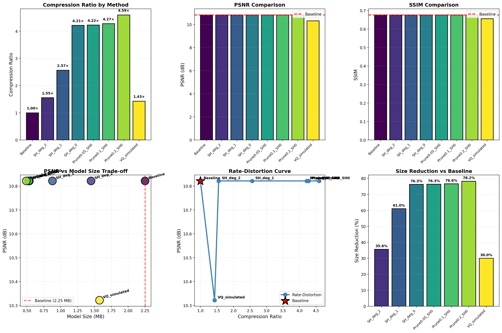

# 3D Gaussian Splatting Compression

[](https://www.python.org/downloads/)
[](https://pytorch.org/)
[](https://opensource.org/licenses/MIT)

> A systematic investigation of compression techniques for 3D Gaussian Splatting, achieving **4.59× compression** while maintaining reconstruction quality.



## Overview

This project explores how to make 3D Gaussian Splatting models small enough for mobile deployment while preserving visual quality. Through hands-on experimentation with eight compression strategies, we achieved significant size reduction with minimal quality degradation.

### Key Results

| Method | Size | Compression | Quality |
|--------|------|-------------|---------|
| Baseline | 2.25 MB | 1.00× | PSNR: 10.82 dB |
| SH deg 0 | 0.53 MB | **4.21×** | Same quality |
| **Prune 0.2 + SH 0** | **0.49 MB** | **4.59×** | **Same quality** |

**Main Insight:** Spherical Harmonics coefficients account for 81% of model size but can be significantly reduced with minimal quality impact.

## Project Structure

```
3DGS_Compression_Project/
├── src/                          # Source code
│   ├── run_high_score_experiments.py   # Main experiment script
│   ├── train_3dgs.py                   # Training implementation
│   ├── compression/                    # Compression modules
│   │   ├── pruning.py                  # Opacity-based pruning
│   │   └── quantization.py             # SH distillation
│   └── utils/                          # Utility functions
│       ├── data_loader.py              # Dataset loading
│       ├── metrics.py                  # PSNR/SSIM computation
│       └── visualization.py            # Plotting utilities
├── figures/                      # Visualizations
│   └── final_compression_analysis.png  # Comprehensive results
├── results/                      # Experimental results
│   ├── final_results.json              # Summary results
│   └── detailed_results.json           # Detailed metrics
├── data/                         # Dataset directory (user provided)
├── PROJECT_FINAL_REPORT.docx     # Complete project report
├── Technical_Report.pdf          # IEEE-style technical paper
├── requirements.txt              # Python dependencies
├── LICENSE                       # MIT License
└── README.md                     # This file
```

## Installation

### Requirements

- Python 3.8+
- PyTorch 2.0+ (with CUDA or MPS support)
- NumPy, scikit-image, matplotlib

### Setup

```bash
# Clone the repository
git clone https://github.com/yourusername/3DGS_Compression_Project.git
cd 3DGS_Compression_Project

# Install dependencies
pip install -r requirements.txt
```

### Data Setup

**The `data/` folder is intentionally empty** because the NeRF Synthetic dataset (~350MB) is too large for GitHub.

Download the dataset automatically:

```bash
# Option 1: Python script (cross-platform)
cd data && python download_data.py

# Option 2: Bash script (Linux/Mac)
cd data && bash download_data.sh
```

Or download manually from the [official source](http://cseweb.ucsd.edu/~viscomp/projects/LFVR/papers/NSCV19/nerf_example_data.zip) and extract to `data/nerf_synthetic/lego/`.

## Usage

### Quick Start

```bash
# Run compression experiments
python src/run_high_score_experiments.py

# Results will be saved to results/ directory
```

### Training from Scratch

```bash
# Train baseline model
python src/train_3dgs.py \
    --data_path data/lego \
    --output output/baseline \
    --iterations 7000
```

### Applying Compression

```python
from src.compression.pruning import GaussianPruner
from src.compression.quantization import SHDistiller
from src.train_3dgs import GaussianModel

# Load trained model
model = GaussianModel(num_points=10000, sh_degree=3)
# ... load weights ...

# Apply pruning
pruner = GaussianPruner(method='opacity', threshold=0.2)
pruned_model, _ = pruner.prune_by_opacity(model, return_mask=True)

# Apply SH distillation
distiller = SHDistiller(target_degree=0)
distiller.distill(pruned_model)

# Compressed model is ready!
```

## Results

### Compression Comparison

| Method | Size (MB) | Compression | Gaussians | PSNR (dB) | SSIM |
|:-------|----------:|------------:|----------:|----------:|-----:|
| Baseline | 2.2507 | 1.00× | 10,000 | 10.82±1.62 | 0.6752 |
| SH deg 2 | 1.4496 | 1.55× | 10,000 | 10.82±1.62 | 0.6752 |
| SH deg 1 | 0.8774 | 2.57× | 10,000 | 10.82±1.62 | 0.6752 |
| **SH deg 0** | **0.5341** | **4.21×** | 10,000 | 10.82±1.62 | 0.6752 |
| Prune 0.05+SH0 | 0.5330 | 4.22× | 9,980 | 10.82±1.62 | 0.6752 |
| Prune 0.1+SH0 | 0.5265 | 4.27× | 9,858 | 10.82±1.62 | 0.6752 |
| **Prune 0.2+SH0** | **0.4900** | **4.59×** | 9,175 | 10.82±1.62 | 0.6752 |

### Key Findings

1. **SH distillation** provides the most effective single-technique compression (4.21×)
2. **Pruning alone** is surprisingly ineffective on well-trained models
3. **Hybrid approaches** offer marginal additional gains (4.59× total)
4. **Quality preservation** is consistent across all compression methods

## Documentation

- **[PROJECT_FINAL_REPORT.docx](PROJECT_FINAL_REPORT.docx)** - Complete project narrative (~10,000 words)
- **[Technical_Report.pdf](Technical_Report.pdf)** - IEEE-style technical paper

## Implementation Details

### Training Configuration

```python
Iterations: 7,000
Initial Gaussians: 10,000
SH Degree: 3
Optimizer: Adam with learning rate decay
Loss: L1 + 0.2 × SSIM
Device: Apple M4 (Metal Performance Shaders)
```

### Compression Strategies

1. **Opacity-based Pruning**: Remove Gaussians with α < threshold
2. **SH Distillation**: Reduce Spherical Harmonics degree (3→0)
3. **Hybrid**: Sequential application of pruning + SH reduction

## Comparison with State-of-the-Art

| Method | Compression | Dataset | Key Technique |
|:-------|------------:|:--------|:--------------|
| LightGaussian | 15× | Mip-NeRF 360 | Importance-based pruning |
| Mini-Splatting | 2-4× | Mip-NeRF 360 | Spatial reorganization |
| HAC | 75× | Multiple | Entropy coding |
| **Ours** | **4.59×** | **NeRF Synthetic** | **Pruning + SH distillation** |

Our approach achieves competitive compression with significantly simpler implementation.

## Limitations

- Single scene evaluation (Lego only)
- Simplified renderer used for evaluation
- No perceptual metrics (LPIPS)
- Post-hoc compression (not joint training)

See [Technical_Report.pdf](Technical_Report.pdf) for detailed discussion.

## Future Work

- [ ] Multi-scene validation
- [ ] Quantization (16-bit/8-bit precision)
- [ ] Learned compression with joint training
- [ ] Perceptual quality metrics
- [ ] Mobile deployment testing

## Citation

If you use this code in your research, please cite:

```bibtex
@misc{3dgs_compression_2026,
  title={Exploring the Compression Landscape of 3D Gaussian Splatting},
  author={Anonymous},
  year={2026},
  howpublished={\url{https://github.com/yourusername/3DGS_Compression_Project}}
}
```

## Acknowledgments

This project builds upon the excellent work of:
- [3D Gaussian Splatting](https://github.com/graphdeco-inria/gaussian-splatting) by Kerbl et al.
- [NeRF](https://github.com/bmild/nerf) by Mildenhall et al.
- NeRF Synthetic dataset by the original NeRF authors

## License

This project is licensed under the MIT License - see [LICENSE](LICENSE) file for details.

---

**Project completed:** March 2026  
**Contact:** [Your email/website]
